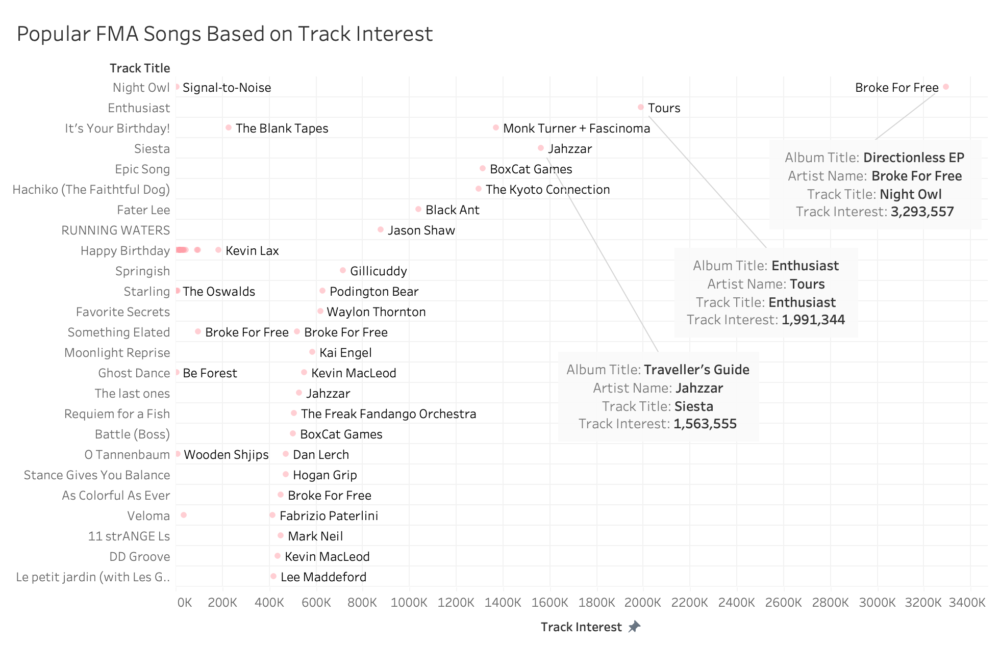
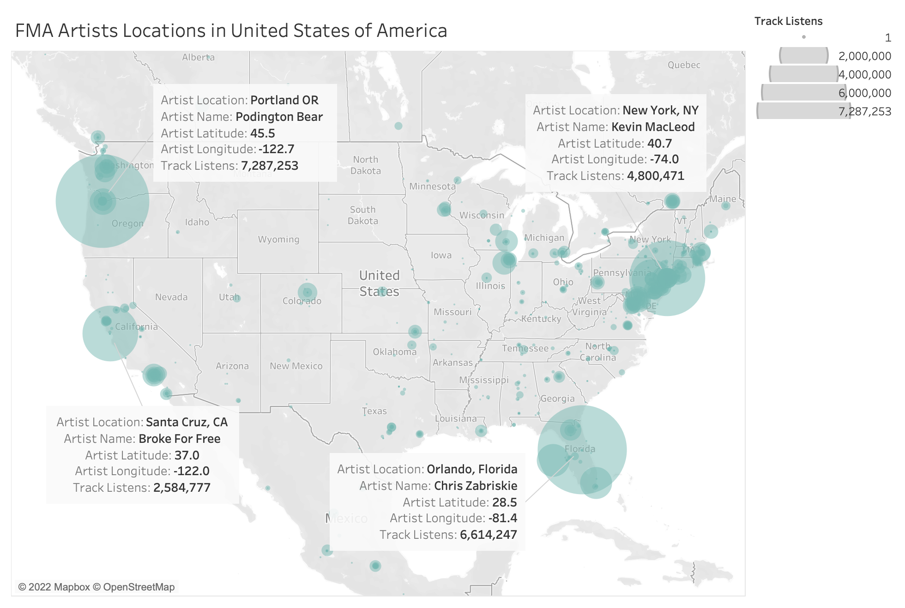

### Exploring Popular Artists, Albums and Songs on FMA
By <a href="https://github.com/charlesrroberts">Charles Roberts</a> 

  
The Free Music Archive (FMA) is a website that offers free access to open licensed, original music which is curated by netlabels and thousands of independent musicians around the world. The FMA website claims that it receives tens of millions of visitors every month who download music for personal use. Users share and remix music from FMA in videos, podcasts, films, games, apps, and school projects.

The FMA was founded in 2009 by radio station WFMU-FM which is a listener-supported, non-commercial radio station broadcasting in Jersey City, NJ. WFMU is currently the longest running freeform radio station in the United States.

We live in an era of user-generated online content with the rise of YouTube, TikTok and Instagram. I thought it would be interesting to analyze an independent music platform, like FMA, because community-generated or user-generated content has the potential to impact a wider audience than branded content. A survey from 2019 states that “Consumers are 2.4x more likely to say user-generated content is authentic compared to brand-created content” <a href="https://stackla.com/resources/reports/bridging-the-gap-consumer-marketing-perspectives-on-content-in-the-digital-age/" target="_blank">Stackla, 2019</a>. When I visit the FMA I get the feeling that the content is authentic  and trustworthy as opposed to the Spotify or Apple Music brands where they are trying to market or sell something to you. 

I used Tableau and Tableau Prep for data exploring, analyzing and creating visualizations. Using the FMA data, I want to answer the following questions:

1. What genres of music are available on the Free Music Archive?
2. Who are the popular artists on the Free Music Archive?
3. What are the popular albums on the Free Music Archive?
4. What are the popular songs on the Free Music Archive?
5. Is there a correlation between listens and interest between Free Music Archive artists?
6. Where are the popular Free Music Archive artists geographically located?

## Data Collection

Data Source: <a href="https://github.com/mdeff/fma" target="_blank">https://github.com/mdeff/fma</a>

The FMA dataset provides data on 917 GiB of Creative Commons-licensed audio files from 106,574 tracks from 16,341 artists and 14,854 albums, arranged in a hierarchical taxonomy of 161 genres. The dataset was published in 2017 and contains data from 2009 to 2017.  

There are 9 datasets included in the FMA GitHub repository but for my purposes I am focusing on select metadata from 2 data tables on the following fields:

**tracks.csv**

<ul>
    <li>artist name</li> 
    <li>track title</li>
    <li>#listens</li> 
    <li>interest</li> 
    <li>genres_top</li>
    <li>active_year_begin</li> 
</ul>

<ul> 
     <li>album title</li>
    <li>album type</li>
    <li>album #listens</li> 
    <li>location</li> 
    <li>longitude</li> 
    <li>latitude</li>    
</ul>

**genre.csv**
-	genre title
-	#tracks 

## Cleaning

The data I am interested in analyzing was organized well so there was not much cleaning needed. I used Tableau Prep to clean up the column headers and remove unwanted columns. I create a calculated field in Tableau Prep to find how long each individual artist has been active on the website. I used the artist_date_created column which provides a date for when each artist became active on the website. Since the data table includes data up to and including 2017, I decided to create a DATEDIFF calculation between artist_date_created and 2018-01-01.

Artist Duration Calculated Field
-	`DATEDIFF('day',[artist date_created], #2018-01-01#)`

## What genres of music are available on the Free Music Archive?

My initial question when looking at the data is who uses the FMA? Initially, I wanted to find the popular genres on the FMA but I found that many artists categorize themselves by multiple genres for their music. It was difficult to analyze the top genre based on artist “listens” or “interest” data because of the overlap of multiple genres for each artist. I felt it was best to look at the number of tracks associated with each genre.

I analyzed genre title and the number of tracks for each genre which shows that Experimental, Electronic and Rock genres have the highest number of tracks on the FMA compared to the other music genres. These results suggest that the Experimental music genre is predominant on the FMA.   

## Who are the popular artists on the Free Music Archive?

I want to know who are the popular artists on FMA, but this can be a tricky question because there are a lot of ways to measure whether an artist is popular or successful. For my analysis I measured popularity on the FMA by listens and interest counts of tracks and albums.

The above bar chart shows the artists with the largest coiunt of track listens. The chart shows that _Podington Bear_ has the largest count of track listens with a count 7,287,253.

The above bar chart shows the artists with the largest count of track interest. The chart shows that _Podington Bear_ has the largest count of track interest with a count 9,922,230.

Counting the number of listens and interest is a good indicator of the popular artists on FMA but I also wanted to measure how long they have been active on the website. If an artist has been active on the FMA for a long period of time they would have more time to gain listens and interest.

The above chart shows the number of days the top 5 most popular artists, by listens and interest, have been active on the FMA. I used a calculated field to get the artists length of time, in days, on the FMA. I calculated the difference between the artist_date_created field and a chosen year of 2018 because the dataset only has data up to and including 2017.

_Podington Bear_ has been on the website the longest, at 2814 days, which may be a good indicator of why they have the most listens and interest. _Kevin Macleod, Chris Zabriskie_ and _Jahzzar_ have been on the website for less time but they have similar listens and interest counts to _Podington Bear_. It should be noted that _Kai Engel_ has only been on the site for 1600 days at this point but ranks quite high for listens and interest suggesting that they are a popular artist compared to the other top artists.

Podington Bear on FMA <a href="https://freemusicarchive.org/music/Podington_Bear" target="_blank">https://freemusicarchive.org/music/Podington_Bear</a> 
Kevin Macleod on FMA <a href="https://freemusicarchive.org/music/Kevin_MacLeod" target="_blank">https://freemusicarchive.org/music/Kevin_MacLeod</a> 
Jahzzar on FMA <a href="https://freemusicarchive.org/music/Jahzzar" target="_blank">https://freemusicarchive.org/music/Jahzzar</a> 
Kai Engel on FMA <a href="https://freemusicarchive.org/music/Kai_Engel" target="_blank">https://freemusicarchive.org/music/Kai_Engel</a>

## What are the popular albums on the Free Music Archive?

I thought it would be good to start off by looking at what types of albums are on the FMA. The FMA categorizes album type into five categories:

-	Album
-	Radio Program
-	Live Performance
-	Single Tracks
-	Contest

The above bar chart shows the types of albums ranked by the count of album listens. The chart shows that the album type _Album_ is quite predominant with the most album listens over the other types.

I want to know what are the popular albums on the FMA. For my analysis, I compared the album listens count for all the albums on the FMA.

The above bar chart shows the albums with the largest number of album listens. The chart shows us that the album “Entries” has the largest number of album listens with a count 495,429,777. The “microSong Entries” album is the second most listened to album with 100,934,450 listens followed by “Bonus Beat Blast 2011” with 58,985,533 listens. 

It should be noted that the “Entries” and “microSong Entries” are compiled contest albums where artists submit tracks that get judged for prizes. These contest albums are promoted on the FMA thus drawing a lot of attention and interest which may increase the album listens count. “Entries” features 108 artists with 139 tracks and “microSong Entries” features 115 artists with 310 tracks. The fact that these contest albums are promoted on the FMA and have many artists and tracks are good indicators as to why the album listens counts are large. The “Bonus Beat Blast 2011” album features 31 artists with 73 tracks and may possibly be the most popular album that does not have over 100 artists and is not part of any FMA promotions or contests.

Expanding on my analysis of the most popular album on the FMA, I looked at albums released by individual artists. For my analysis I measured each album's popularity on the FMA by comparing the album listens count for each artist.

The above dot strip plot shows that _Podington Bear_ is ranked the highest with 40 albums and 6,356,117 album track listens. Since we’re looking at individual albums, we can clearly see that the “Nameless: Hacker RPG Soundtrack” by _BoxCat Games_ is the most popular album with 1,533,769 listens. It should be noted that the album is a soundtrack by independent video game developer _BoxCat Games_ featuring a compilation of mutiple artists. The data shows us that “Cylinders” by _Chris Zabriskie_ is the most popular album by an individual artist with 1,363,291 listens.

## What are the popular songs on the Free Music Archive?

I want to know what are the popular songs on the FMA. For my analysis I measured a song's popularity on the FMA by comparing track listens and interest counts for each track.

The above dot strip plot shows the songs with the largest number of track listens. The chart shows us that “Happy Birthday” is the most popular song but it should be noted that 23 different artists have this song title. A lot of “Happy Birthday” tracks are featured on the “Entries” contest album which would increase listens. The most popular song measured by track listens is “Night Owl” by _Broke For Free_ with 543,242 track listens.

The above dot strip plot shows the songs with the largest number of track interest. The chart shows us that the most popular song measured by interest is “Night Owl” by _Broke For Free_ with 3,293,557 track interests. 

Overall, the most popular song on the FMA by an individual artist is “Night Owl” by _Broke For Free_ with the largest number of listens and interest.

## Is there a correlation between listens and interest between Free Music Archive artists?

I want to know if there is a correlation between listens and interest between FMA artists. For my analysis I measured the correlation between FMA artists' track listens and track interest counts. It should be noted that for this analysis normalizing the data did not alter the results.

The above scatter plot shows the correlation between track listens and track interest for each artist. The plot shows us that there is a strong correlation between listens and interest for artists that have under 1 million track listens and interest counts. As the counts gets larger most artists exist around the trend line. The most popular artists sit above the trend line with larger track interest counts than track listens. Overall, there is a correlation between listens and interest for the majority of artists on the FMA because as track listen counts increase so does the track interest count.

I want to know if there is a correlation between listens and interest for each song by the most popular artists on the FMA. For my analysis I measured the correlation between FMA artists' track listens and track interest counts for each song.

The above scatter plots show the correlation between track listens and track interest for _Podington Bear, Chris Zabriskie, Jahzzar_ and _Kevin Macleod_. It is interesting to note that there is a strong correlation between listens and interest for _Chris Zabriskie’s_ songs distributed along the trend line.
 

## Where are the popular Free Music Archive artists geographically located?

I want to know where the popular artists on the FMA are located around the world. For my analysis I used latitude and longitude coordinates to position all the artists on a map. I used a size label to represent track listens in order to differentiate the popular artists. 

The above symbol map shows that most of the FMA artists are located in the United States and Western Europe. It should be noted that I can not account for artists having a location listed that is different than their listed longitude and latitude. Also, I cannot account for some artists who have longitude and latitude coordinates that position them in the middle of the ocean. I am not sure how this information is acquired and I decided to not alter this data in the cleaning process.

The above symbol map shows FMA artists located in the United States. The majority of artists I found in my analysis that I demonstrated to be popular are located on the west and east coasts of the United States.

The above symbol map shows FMA artists located in Western Europe. The map shows us that there is a large FMA artist base in Western Europe, but the most popular FMA artists are located in the United States.

## Conclusion

The Experimental genre has the largest number of tracks on the FMA. Based on track listens and track interest _Podington Bear_ is the most popular artist followed by _Kevin Macleod, Chris Zabriskie_ and _Jahzzar_. The most popular contest album is “Entries” and the “Nameless: Hacker RPG Soundtrack” by _BoxCat Games_ is the most popular soundtrack album. _Chris Zabriskie’s_ album titled “Cylinders” is the most popular album by an individual artist. The most popular song on the FMA by an individual artist is “Night Owl” by _Broke For Free_ with the largest number of listens and interest.

Track listens and track interest are good indicators of popularity and are correlated based on my analysis. I found that there is a strong correlation between listens and interest for artists that have under 1 million track listens and interest counts. The most popular artists have a larger number of track interest counts than track listens. The correlation between listens and interest is present for the majority of artists on the FMA because as track listen count increases so does the track interest count.

I found that the majority of the most popular FMA artists are located in the United States along the west and east coasts. Western Europe has a large FMA artist base but the most popular FMA artists are located in the United States which is most likely due to the fact that the FMA was created by an American based radio station.

## References

<a href="https://github.com/mdeff/fma" target="_blank">https://github.com/mdeff/fma</a>  
<a href="https://freemusicarchive.org/" target="_blank">https://freemusicarchive.org/</a>  
<a href="https://stackla.com/resources/reports/bridging-the-gap-consumer-marketing-perspectives-on-content-in-the-digital-age/" target="_blank">https://stackla.com/resources/reports/bridging-the-gap-consumer-marketing-perspectives-on-content-in-the-digital-age/</a>
