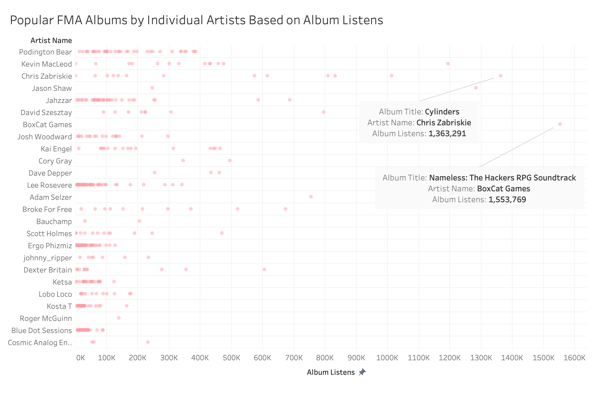

### Exploring Popular Artists, Albums and Songs on FMA

  
Free Music Archive (FMA), founded in 2009 by radio station WFMU, offers free access to open licensed, original music.

The Free Music Archive (FMA) is a website that offers free access to open licensed, original music which is curated by netlabels and thousands of independent musicians around the world. The FMA website claims that they receive tens of millions of visitors every month that download music for personal use. Users share and remix music from FMA in videos, podcasts, films, games, apps, and school projects.

FMA was founded in 2009 by radio station WFMU-FM which is a listener-supported, non-commercial radio station broadcasting in Jersey City, NJ. WFMU is currently the longest running freeform radio station in the United States.

We live in an era of user-generated online content with the rise of YouTube, TikTok and Instagram. I thought it would be interesting to analyze an independent music platform, like FMA, because community-generated or user-generated content has the potential to impact a wider audience than branded content. A Stackla survey from 2019 states that “90% of consumers say authenticity is important when deciding which brands they like and support” (<a href="https://stackla.com/resources/reports/bridging-the-gap-consumer-marketing-perspectives-on-content-in-the-digital-age/" target="_blank">Stackla,2019</a>). When I visit the FMA I get the feeling that the content is authentic  and trustworthy as opposed to the Spotify or Apple Music brands where they are trying to market or sell something to you. 

I utilized Tableau and Tableau Prep for data exploring, analyzing, and creating visualizations. Using the FMA data, I seek to answer the following questions:

1. What genres of music are available on the Free Music Archive?
2. Who are the popular artists on the Free Music Archive?
3. What are the popular albums on the Free Music Archive?
4. What are the popular tracks on the Free Music Archive?
5. Is there a correlation between listens and interest?
6. Where are the popular Free Music Archive artists located?

## Data Collection

Data Source: <a href="https://github.com/mdeff/fma" target="_blank">https://github.com/mdeff/fma</a>

The FMA dataset provides data on 917 GiB of Creative Commons-licensed audio files from 106,574 tracks from 16,341 artists and 14,854 albums, arranged in a hierarchical taxonomy of 161 genres. The dataset was published in 2017 and contains data from 2009 to 2017.  

There are 9 datasets included in the FMA GitHub repository but for our purposes I focused on a select portion of metadata from 2 data tables. I analyzed a select portion of data information on the following fields:

**tracks.csv**

<ul>
    <li>artist name</li> 
    <li>track title</li>
    <li>#listens</li> 
    <li>interest</li> 
    <li>genres_top</li>
    <li>location</li> 
    <li>active_year_begin</li> 
</ul>

<ul> 
     <li>album title</li>
    <li>album type</li>
    <li>album #listens</li> 
    <li>album #listens</li> 
    <li>longitude</li> 
    <li>latitude</li>    
</ul>

**genre.csv**
-	genre title
-	#tracks 

## Cleaning

The data I am interested in analyzing was organized well so there wasn’t much of cleaning to be done. I utilized Tableau Prep to clean up the column headers and remove unwanted columns. I created a custom calculation in Tableau Prep to calculate how long each individual artist has been active on the website. I used the artist_date_created column which provides a date for when each artist became active on the website. Since the data table includes data up to and including 2017 I decided to create a DATEDIFF calculation between artist_date_created and 2018-01-01.

Artist Duration Calculation Field
-	DATEDIFF('day',[artist date_created], #2018-01-01#)

## What genres of music are available on the Free Music Archive?

My initial question when looking at the data is who uses the FMA? Initially, I wanted to find out what are the most popular genres on the FMA but I found that many artists categorize themselves by multiple genres for their music. It was difficult to analyze top genre based on the artist “listens” or “interest” data because of the overlapping and multiple genres.

I analyzed genre title and the number of tracks for each genre which shows that Experimental, Electronic and Rock genres have the highest number of tracks on the FMA compared to the other the music genres. These results suggest that creators of Experimental music are predominant users of the FMA.   

## Who are the most popular artists on the Free Music Archive?

I want to know who is the most popular artist on FMA but this can be a tricky question because there are a lot of ways to measure whether an artist is popular or successful. For my analysis I measured an artist’s popularity on the FMA by listens and interest counts of their songs.

The above bar chart shows the artists with the largest amount of track listens. The chart shows us that Podington Bear has the largest amount of track listens with a count 7,287,253.

The above bar chart shows the artists with the largest amount of interest. The chart shows us that Podington Bear has the largest amount of interest with a count 9,922,230.

Counting the number of listens and interest is a good indicator of the popular artists on FMA but I also wanted to measure how long they have been active on the website. If an artist has been active on the FMA for a long period of time they would have more time to gain listens and interest.

The above chart shows the number of days the most popular artists have been active on the FMA. I used a calculated field to calculate the artist duration on the FMA by using the DATEDIFF function to find the difference in days with the artist_date_created field and the year 2018 because the dataset only has data up to and including 2017.

Podington Bear has been on the site the longest, at 2814 days, which may be a good indicator why they have the most listens and interest. Kevin Macleod, Chris Zabriskie and Jahzzar have been on the site less time but have similar most listens and interest counts to Podington Bear. Kai Engel has only been on the site for 1600 days at this point but still ranks quite high for listens and interest so they should be noted as a quite popular.

Visit <a href="https://freemusicarchive.org/music/Podington_Bear" target="_blank">https://freemusicarchive.org/music/Podington_Bear</a>

## What is the most popular album on the Free Music Archive?

The FMA categorizes album type into five categories:
-	Album
-	Radio Program
-	Live Performance
-	Single Tracks
-	Contest

The above bar chart shows that the category type Album has the most album listens which is a good indicator that this is a popular category.

I want to know what is the most popular album on FMA. For my analysis I measured each albums popularity on the FMA by comparing the album listens count.

The above bar chart shows the albums with the largest amount of listens. The chart shows us that the album called Entries has the largest amount of album listens, by far, with a count 495,429,777. microSong Entries album is the next most listened to album with 100,934,450 listens followed by Bonus Beat Blast 2011 with 58,985,533 listens. 

It should be noted that the Entries and microSong Entries are contest albums where artists submit tracks that get compiled into an album. These contest albums are promoted on the FMA thus drawing a lot of attention interest which may drive the album listens count. Entries features 108 artists with 139 tracks and microSong Entries features 115 artists with 310 tracks. The fact that these contest albums are promoted on FMA and the number of artists and tracks on these two albums are quite large are a good indicator as to why the album listen counts are large. The Bonus Beat Blast 2011 album features 31 artists with 73 tracks and may possibly be the most popular album that doesn’t have over 100 artists and is not part of any FMA promotions or contests.

Expanding on my analysis of what is the most popular album on FMA, I looked at albums released by individual artists rather that aren’t contest albums. For my analysis I measured each albums popularity on the FMA by comparing the album listens count for each artist.

The above dot strip plot shows that Podington Bear is ranked the highest because they have 40 albums with 6,356,117 album track listens. If we’re looking at individual albums, we can clearly see that the Nameless: Hacker RPG Soundtrack by BoxCat Games is a very popular album with 1,533,769 listens; it should be noted that the album is a soundtrack by independent video game developer BoxCat Games, but it is impressive to that many listens. Chris Zabriskie has the most popular album, by an individual artist, called Cylinders with 1,363,291 listens.

## What is the most popular song on the Free Music Archive?

I want to know what is the most popular song on the Free Music Archive. For my analysis I measured a song’s popularity on the FMA by comparing track listens and interest counts.

The above dot strip plot shows the songs with the largest amount of track listens. The chart shows us that Happy Birthday is the most popular song but it should be noted that 23 different artists have this same song title with most of Happy Birthday tracks being featured on the Entries contest album. The most popular song, measured by track listens, is Night Owl by Broke For Free with 543,242 track listens.

The above dot strip plot shows the songs with the largest amount of interest. The chart shows us that the most popular song, measured by interest, is Night Owl by Broke For Free with 3,293,557 track interests. 

Overall, the most popular song on the FMA by an individual artist is Night Owl by Broke For Free with the largest number of listens and interest.

## Is there a correlation between listens and interest?

I want to know if there is a correlation between listens and interest on the Free Music Archive. For my analysis I measured the correlation between FMA artist’s track listens and track interest counts. It should be noted that for this analysis normalizing the data didn’t alter the results.

The above scatter plot shows the correlation between track listens and track interest for each artist. The plot shows us that there is a strong correlation between listens and interest for artists that have under 1 million track listens and interest counts. As the counts gets larger most artists exist around the trend line. The most popular artists sit above the trend line with larger track listen counts but still correlated with track interest. Overall, there is a correlation between listens and interest for the majority of artists on the FMA because as track listen counts increase so does the track interest count.

I want to know if there is a correlation between listens and interest between songs for the popular artists on the Free Music Archive. For my analysis I measured the correlation between FMA artist’s track listens and track interest counts for each song.

The above scatter plots shows the correlation between track listens and track interest for Podington Bear, Chris Zabriskie, Jahzzar and Kevin Macleod. It is interesting to see that there is a strong correlation between listens and interest for Chris Zabriskie songs with an even distribution along the trend line.
 

## Where are the most popular FMA artists located around the world?

I want to know where the most popular artists on the Free Music Archive are located around the world. For my analysis I used latitude and longitude coordinates to position all the artists on a map. I used a size label to represent track listens and differentiate the popular artists. 

The above symbol map show that most of the FMA artists are located in the U.S.A. and Western Europe.

U.S.A.

Western Europe

** I can’t account for artists having a location listed that’s different than the longitude and latitude. I’m not sure how this information is measured.
